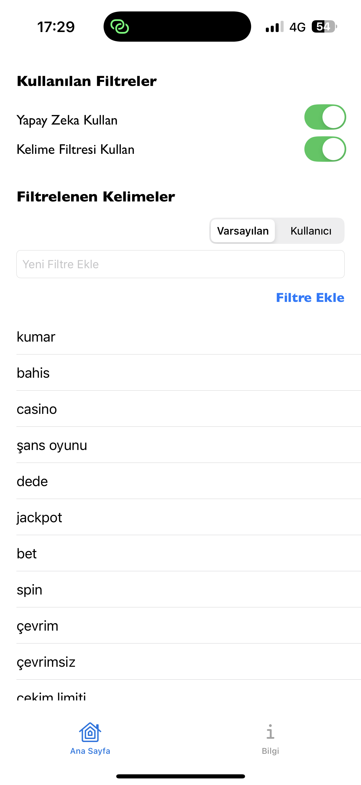
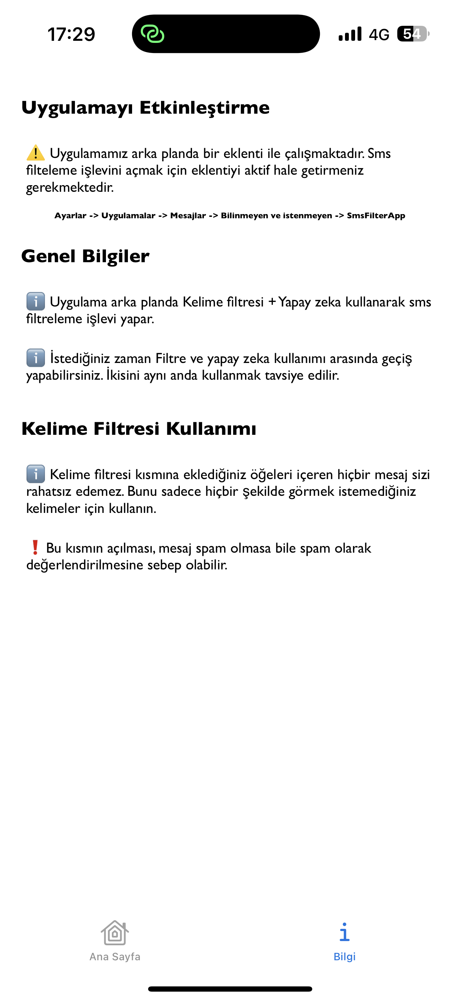
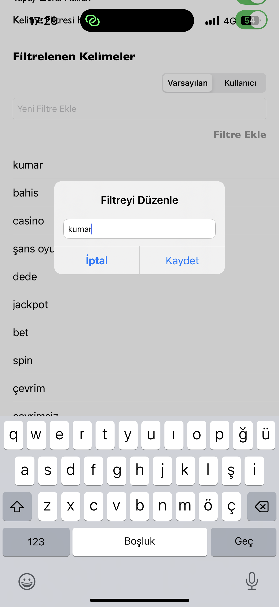
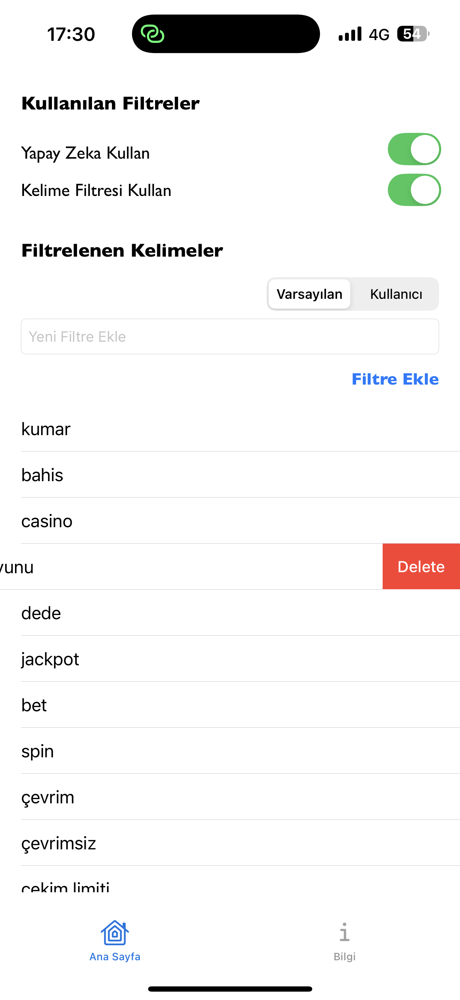

<p align="center">
  
</p>

<h1 align="center">SMSFilterApp 📩</h1>

<p align="center">
  Akıllı SMS mesaj filtreleme sistemi – Yapay zeka ve kelime filtreleri ile spam SMS'leri tespit eder, size sadece önemli olan mesajları bırakır.
</p>

<p align="center">
  <a href="#özellikler">Özellikler</a> •
  <a href="#ekran-görüntüleri">Ekran Görüntüleri</a> •
  <a href="#çalışma-mantığı">Çalışma Mantığı</a> •
  <a href="#kurulum">Kurulum</a>
</p>


---

## Özellikler

- ✅ Spam SMS’leri otomatik algılar
- ✅ Ana uygulama ile filtre kontrolü sağlar
- ✅ Gelişmiş kelime tabanlı filtreleme (JSON tokenizer)
- ✅ %100 yerel çalışır, gizliliğiniz korunur
- ✅ CoreML desteğiyle AI tabanlı model kullanımı

---

## Ekran Görüntüleri

<p float="left">
  
  
  
  
</p>

> Uygulama ekran görüntüleri iphone 16 pro max cihazından alınmıştır.

---

## Çalışma Mantığı

- Uygulama bir app + extension'dan oluşmaktadır. Extension, makine öğrenmesi modeli ile eğitilmiş ve CoreMl kullanılarak iphone cihazlarda lokal olarak çalışabilmesi için entegre edilmiştir.
- Uygulamayı kullanmak için, "ayarlar -> uygulamalar -> mesajlar -> bilinmeyen ve istenmeyen" kısmından aktif hale getirilmesi gerekmektedir.
- Uygulama açıldığında üst kısımdaki butonlar ile yapay zeka ve kelime filtresi açık olarak gelmektedir. (İkisinin de açık olması tavsiye edilir. İsteğinize göre kapatıp açabilirsiniz.)
- Kelime filtresi kısmının kullanılabilmesi için varsayılan veya kullanıcı filtreleri kısmına kelime eklemesi yapmak gerekmektedir. (Bu kısmı kesinlikle SMS'lerinizde görmek istemediğiniz kelimeleri eklemek için kullanın)
- Uygulama aktif edildikten sonra başka bir şey yapılmasına gerek yoktur. Spam mesajlar otomatik olarak filtrelenecek ve size rahatsızlık vermesinin önüne geçilecektir.
- Gelen SMS'ler hiçbir şekilde uygulama dışarısına çıkarılmadan, lokal olarak çalışan yapay zeka ve kelime filtreleri ile incelenip değerlendirilmektedir. Sms'lerinizin güvenliği için hiçbir şekilde veritabanı, internet bağlantı gereksinimi gibi veri güvenliğinizi riske atabilecek kısımlar kullanılmamıştır.
- Her SMS cihazınızda incelenip otomatik olarak filtrelenmektedir. 


---

## Kurulum

```bash
git clone https://github.com/AlperrD/Sms_Filter_App.git
cd SMSFilterApp
open SMSFilterApp.xcodeproj
